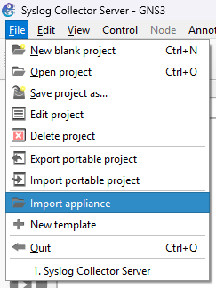
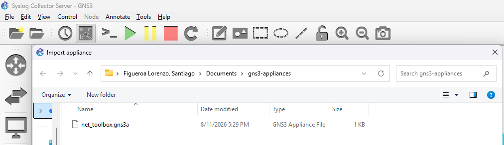
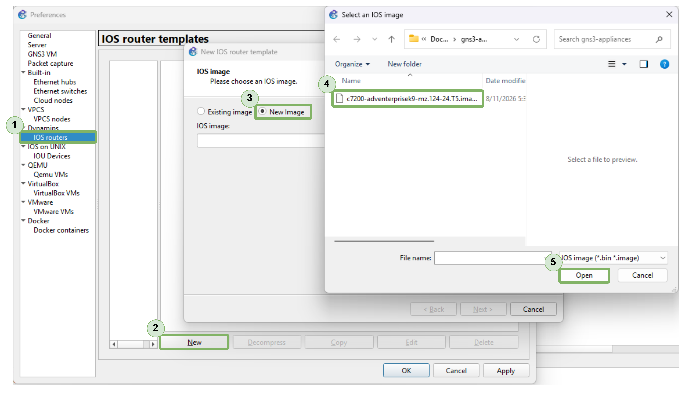
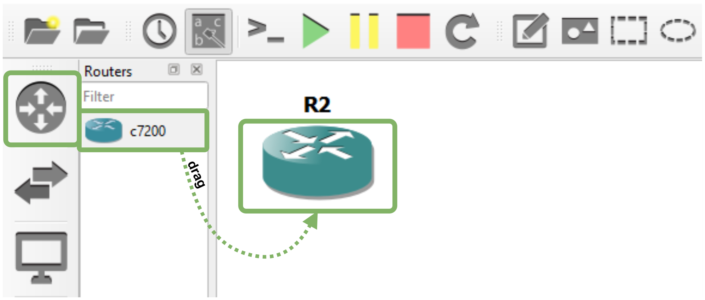
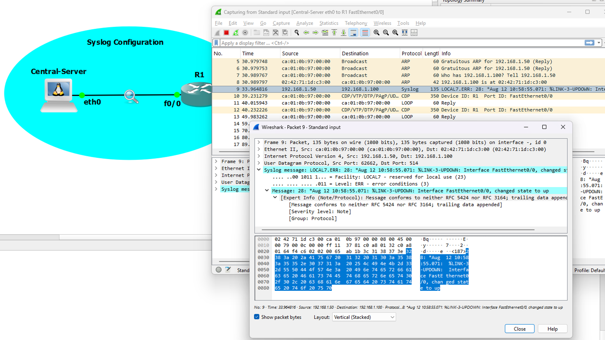

# DEMO: SYSLOG COLLECTION FROM ROUTER

## Overview
 
This demonstration implements log collection architecture using:

- **GNS3 Network Emulation**: Virtual network environment
- **Central-Server (Toolbox Appliance)**: rsyslog server (log collector)
- **R1 (Cisco C7200 Router)**: Log source generating syslog messages

---
 
## Architecture
 
```
┌──────────────────────────────────────────────────────────────┐
│                    GNS3 NETWORK TOPOLOGY                     │
├──────────────────────────────────────────────────────────────┤
│                                                              │
│  ┌────────────────────────┐      ┌─────────────────────┐     │
│  │  Central-Server        │      │   R1 (Router)       │     │
│  │  (Toolbox Appliance)   │      │   (C7200)           │     │
│  │                        │      │                     │     │
│  │  eth0: 192.168.1.100   │──────│  f0/0: 192.168.1.50 │     │
│  │  rsyslog daemon        │      │  IOS 12.4           │     │
│  │  Port: 514 (UDP/TCP)   │      │  Logging enabled    │     │
│  │                        │      │                     │     │
│  └────────────────────────┘      └─────────────────────┘     │
│           │                                                  │
│           └──────── RFC 5424 Syslog (UDP:514) ──────────┐    │
│                                                         │    │
│           Logs stored in:                               │    │
│           /var/log/R1/syslog.log  ←─────────────────────┘    │
│                                                              │
└──────────────────────────────────────────────────────────────┘
```
---
 
## Prerequisites

### GNS3 Setup

1. GNS3 installed and running

2. Toolbox appliance (GNS3 default)

    - Download appliance from https://gns3.com/marketplace/appliances/networkers-toolkit

    - Select appliance:

        

    - Import appliance:

        

    - Drag device:

        

- Cisco C7200 router image available

    - Download dynamips from https://drive.google.com/file/d/1cQ3y24eMJ3SjwLWeAu_hxIsO51Y0CRHX/view?usp=sharing

    - Select preferences:

        

    - Import dynamips:

        

    - Drag device:

        

## INTERCONNECT INFRASTRUCTURE

1. Interconnect devices:

    

## STEP 1: CONFIGURE CENTRAL-SERVER INTERFACE

Assign IPv4 address to Central-Server's eth0 interface so it can receive syslog messages from R1.

- Access R1 Console: In GNS3, right-click R1 → Console → Connect or use telnet from a Linux VM, e.g.:
 
 ```bash
 test@test:~$ telnet 192.168.98.130 5000
 ```

- Configure IP address in the Server eth0 interface:

 ```bash
 root@Central-Server:~# ip link set eth0 up
 root@Central-Server:~# ip addr add 192.168.1.100/24 dev eth0
 root@Central-Server:~# ip a show eth0
 ```

## STEP 2: CONFIGURE RSYSLOG SERVER

Enable rsyslog to listen on UDP/TCP port 514 and receive syslog messages from remote devices (R1).

- Verify rsyslog Configuration
 
 ```bash
 root@Central-Server:~# cat /etc/rsyslog.conf | grep -A2 "MODULES"
 ```

- Verify UDP/TCP Inputs are Enabled

 ```bash
 module(load="imudp")
 input(type="imudp" port="514")
 
 module(load="imtcp")
 input(type="imtcp" port="514")
 ```

- Create Log Directory for R1
 
 ```bash
 root@Central-Server:~# mkdir -p /var/log/R1
 root@Central-Server:~# chown syslog:adm /var/log/R1
 root@Central-Server:~# chmod 755 /var/log/R1
 ```

- Add Log Routing Rules by editing `/etc/rsyslog.conf`:
 
 ```bash
 root@Central-Server:~# nano /etc/rsyslog.conf
 ```

- Add at the end of the file (before any `$IncludeConfig` directives):
 
 ```bash
 # Route logs from R1 by IP address
 :fromhost-ip, isequal, "192.168.1.50" /var/log/R1/syslog.log
 :fromhost-ip, isequal, "192.168.1.50" stop
 
 # Catch-all for other remote logs
 *.* /var/log/remote-hosts.log
 ```

- Restart rsyslog
 
 ```bash
 root@Central-Server:~# service rsyslog restart
 ```

 **Expected Output:**

 ```log
 * Stopping enhanced syslogd rsyslogd                                  [ OK ] 
 * Starting enhanced syslogd rsyslogd                                  [ OK ]
 ```

## STEP 3: VERIFY RSYSLOG IS LISTENING

Confirm rsyslog daemon is listening on UDP and TCP port 514.

- Check Listening Ports
 
 ```bash
 root@Central-Server:~# ss -tulpn | grep 514
 ```

 **Expected Output**
 
 ```
 udp     UNCONN   0        0                0.0.0.0:514            0.0.0.0:*      users:(("rsyslogd",pid=336,fd=6))
 udp     UNCONN   0        0                   [::]:514               [::]:*      users:(("rsyslogd",pid=336,fd=7))
 tcp     LISTEN   0        25               0.0.0.0:514            0.0.0.0:*      users:(("rsyslogd",pid=336,fd=8))
 tcp     LISTEN   0        25                  [::]:514               [::]:*      users:(("rsyslogd",pid=336,fd=9))
 ```

## STEP 4: CONFIGURE CISCO R1 NETWORK INTERFACE

Enable FastEthernet0/0 interface on R1 and assign IP address so it can reach Central-Server.

- Access R1 Console: In GNS3, right-click R1 → Console → Connect or use telnet from a Linux VM:
 
 ```bash
 test@test:~$ telnet 192.168.98.130 5002
 ```

- Configure Interface
 
 ```bash
 R1> enable
 R1# configure terminal
 R1(config)# interface FastEthernet0/0
 R1(config-if)# no shutdown
 R1(config-if)# ip address 192.168.1.50 255.255.255.0
 R1(config-if)# exit
 R1(config)# exit
 ```

- Verify Interface is UP
 
 ```bash
 R1# show interfaces FastEthernet0/0
 ```

 **Expected Output:**

 ```log
 FastEthernet0/0 is up, line protocol is up (connected)
   Hardware is Gt96k FE, address is 0000.0001.0001 (bia 0000.0001.0001)
   Internet address is 192.168.1.50/24
   MTU 1500 bytes, BW 100000 Kbit/sec
 ```

- Test Connectivity to Central-Server
 
 ```bash
 R1# ping 192.168.1.100
 Type escape sequence to abort.
 Sending 5, 100-byte ICMP Echoes to 192.168.1.100, timeout is 2 seconds:
 !!!!!
 Success rate is 100 percent (5/5), round-trip min/avg/max = 16/28/36 ms
 ```

## STEP 5: CONFIGURE CISCO R1 SYSLOG

Configure R1 to send log messages to Central-Server's rsyslog server.

- Configure Syslog Server
 
 ```bash
 R1# configure terminal
 R1(config)# logging 192.168.1.100
 R1(config)# logging facility local7
 R1(config)# logging trap informational
 R1(config)# exit
 ```

- Verify Syslog Configuration
 
 ```bash
 R1# show logging
 ```

 **Expected Output:**
 
 ```log
 Syslog logging: enabled (0 messages dropped, 2 messages rate-limited,
                 0 flushes, 0 overruns, xml disabled, filtering disabled)
 ...
     Trap logging: level informational, 15 message lines logged
         Logging to 192.168.1.100  (udp port 514,  audit disabled,
               authentication disabled, encryption disabled, link up),
               2 message lines logged
 ```

## STEP 6: GENERATE TEST LOG MESSAGES

Trigger log messages from R1 to verify they're being sent to Central-Server.

- Trigger Interface Changes
 
 ```bash
 R1# configure terminal
 R1(config)# interface FastEthernet0/0
 R1(config-if)# shutdown
 R1(config-if)# no shutdown
 R1(config-if)# end
 ```

 This generates messages like:
  - `%LINK-3-UPDOWN: Interface FastEthernet0/0, changed state to up`
  - `%LINEPROTO-5-UPDOWN: Line protocol on Interface FastEthernet0/0, changed state to up`

- Trigger Configuration Changes
 
 ```bash
 R1# configure terminal
 R1(config)# hostname R1-TEST
 R1(config)# hostname R1
 R1(config)# exit
 ```
 
 This generates:
  - `%SYS-5-CONFIG_I: Configured from console by console`

## STEP 7: VERIFY LOG RECEIPT ON CENTRAL-SERVER

Confirm that syslog messages from R1 are being received and stored properly.

- Check Logs in Real-Time
 
 ```bash
 root@Central-Server:~# tail -f /var/log/R1/syslog.log
 ```

 Leave this running, then trigger events on R1. You should see logs appear immediately.
 
 **Example Output:**
 
 ```log
 Aug 11 16:25:57 192.168.1.50 24: *Aug 11 16:20:45.871: %SYS-5-CONFIG_I: Configured from console by console
 Aug 11 16:25:58 192.168.1.50 25: *Aug 11 16:20:46.123: %LINK-3-UPDOWN: Interface FastEthernet0/0, changed state to up
 Aug 11 16:25:59 192.168.1.50 26: *Aug 11 16:20:47.456: %LINEPROTO-5-UPDOWN: Line protocol on Interface FastEthernet0/0, changed state to up
 ```

- Syslog transmission in action is captured using Wireshark

    

- Analysis compartive 5424 Theory vs Actual capture
 
  - Theory (From RFC 5424)
 
   ```log
   <PRI>TIMESTAMP HOSTNAME TAG CONTENT
   <187>Aug 12 10:58:55 R1 Cisco-IOS: %LINK-3-UPDOWN...
   ```
 
  - Actual Capture (With Cisco Extensions)
 
   ```log
   <187>:: *Aug 12 10:58:55.071: %LINK-3-UPDOWN...
   ```
 
  - **Differences:**
    - `::` prefix (Cisco-specific)
    - `*` before timestamp (Cisco-specific)
    - Milliseconds in timestamp (.071)
    - Device-generated timestamp (not syslog server timestamp)
    **Validation:** Despite Cisco extensions, message is still syslog-compatible and successfully received by rsyslog server.