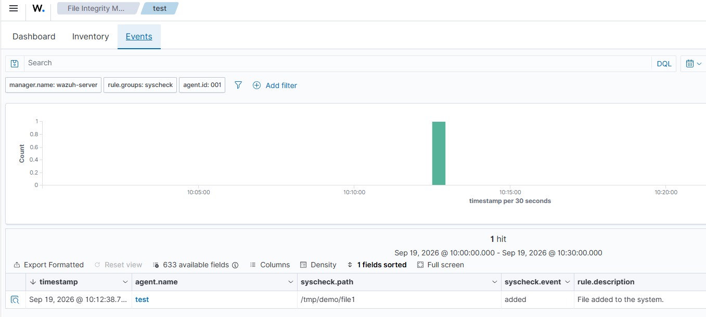
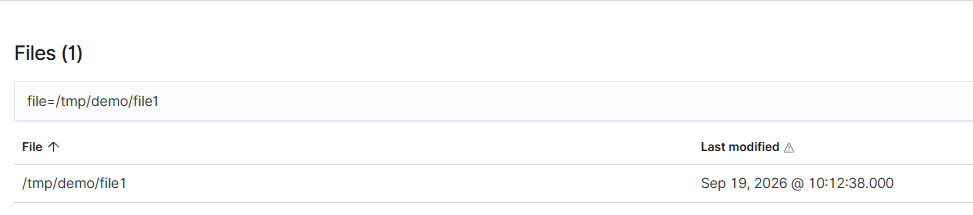

# Usar el el módulo FIM:

1. Instalar Wazuh agent en un [entorno Linux](https://documentation.wazuh.com/current/installation-guide/wazuh-agent/wazuh-agent-package-linux.html): 
2. Instalar Audit

    ```bash
    sudo apt -y install auditd
    sudo systemctl start auditd
    sudo systemctl enable auditd
    ```
3. Crear carpeta para ser monitorizada: `mkdir /tmp/demo`
4. Declararla en archivo de config en `/var/ossec/etc/ossec.conf`: 
    <directories realtime=”yes”>/tmp/demo</directories>
5. systemctl restart wazuh-agent
6. systemctl status wazuh-agent
7. Crear archivo en directorio de prueba: `touch /tmp/demo/file1`
8. Visualizar eventos generados tras la creación del archivo test1:

    

9. Ejecutar query para buscar el archivo:

    