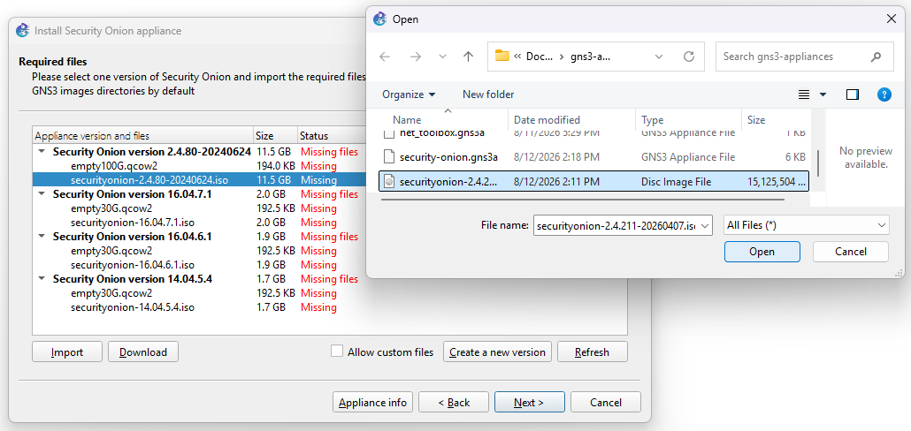
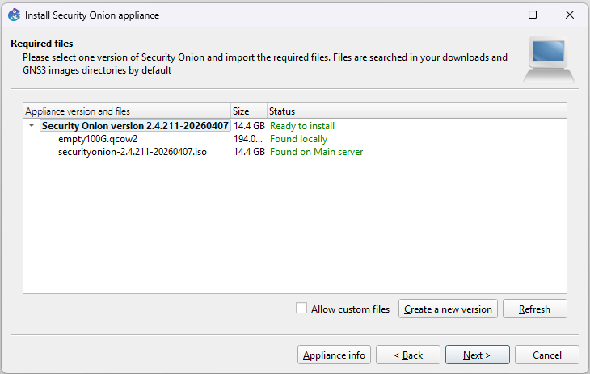
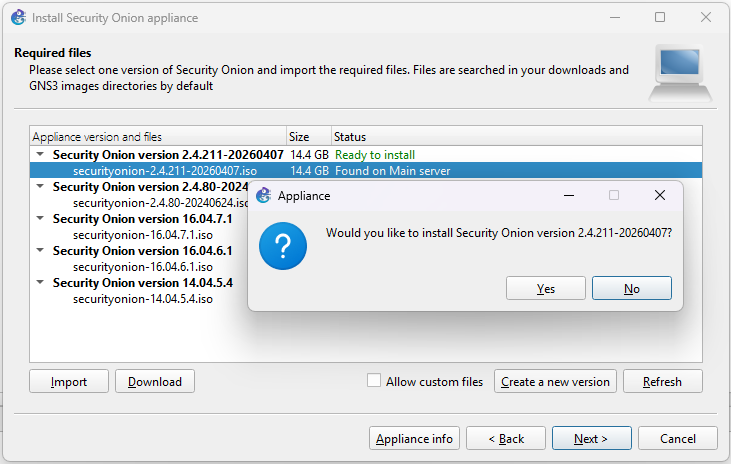
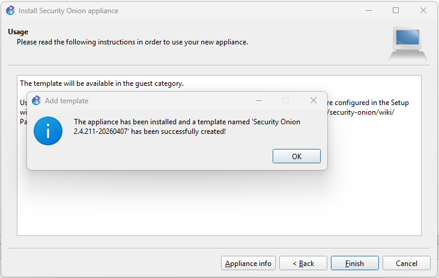
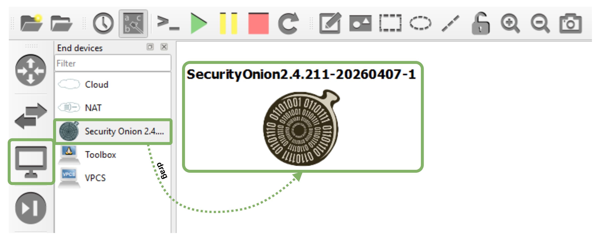

# DEMO: SYSLOG COLLECTION FROM SECURITY ONION

## Prerequisites

### GNS3 Setup

1. GNS3 installed and running

2. Toolbox appliance (GNS3 default)

    - Download appliance from https://gns3.com/marketplace/appliances/networkers-toolkit

    - Download appliance from this repo: [security-onion.gns3a](./security-onion.gns3a)

    - Select appliance:

        

    - Import appliance:

        

    - Upload the ISO image:

        

    - Uploaded image:

        

    - Request for installation:

        

    - Installed image:

        

    - Drag appliance:

        