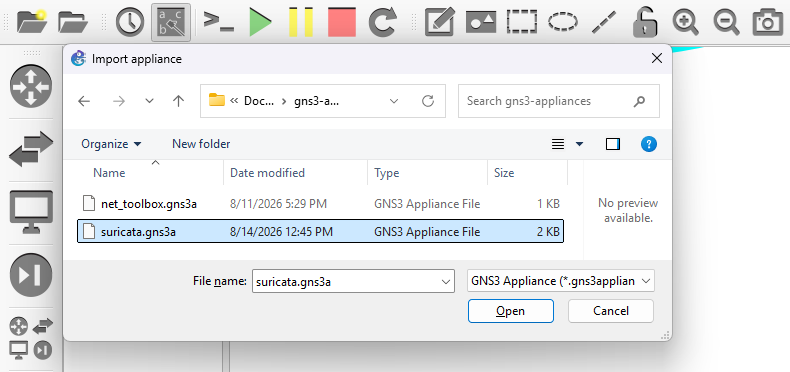
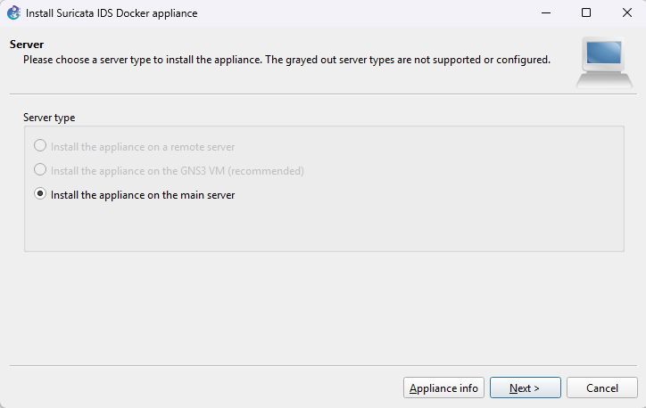
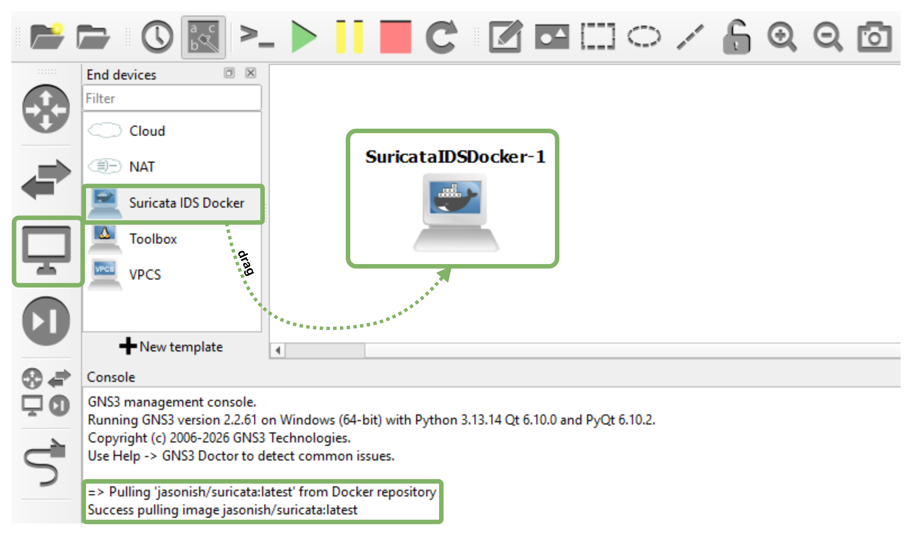
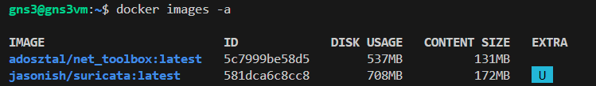
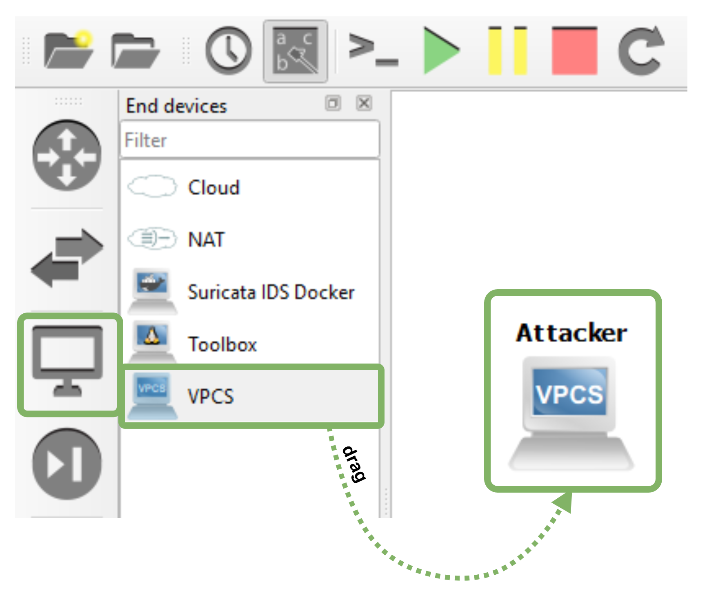
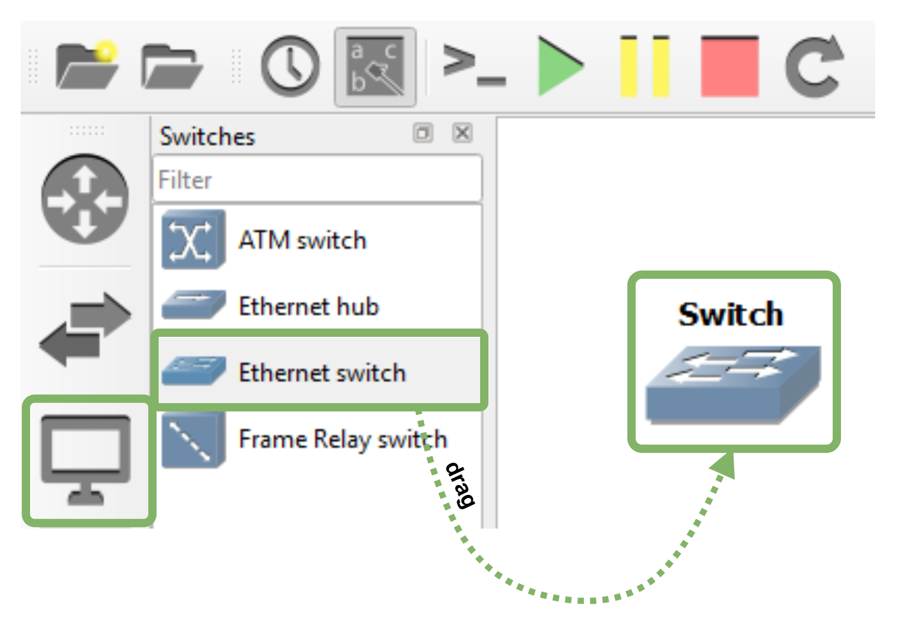
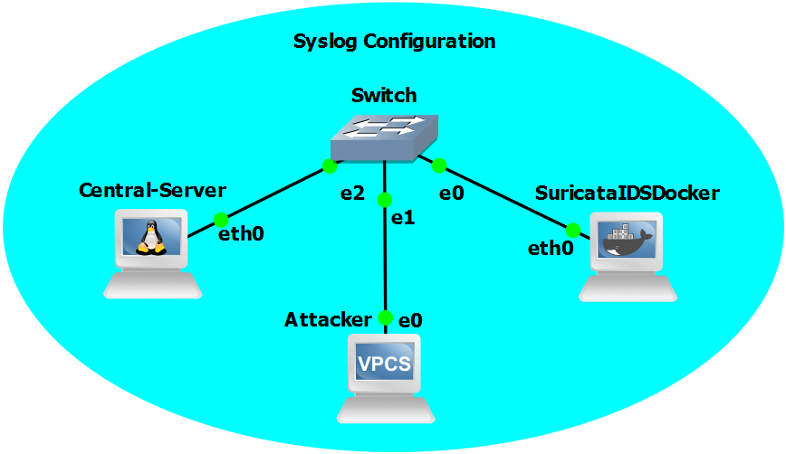
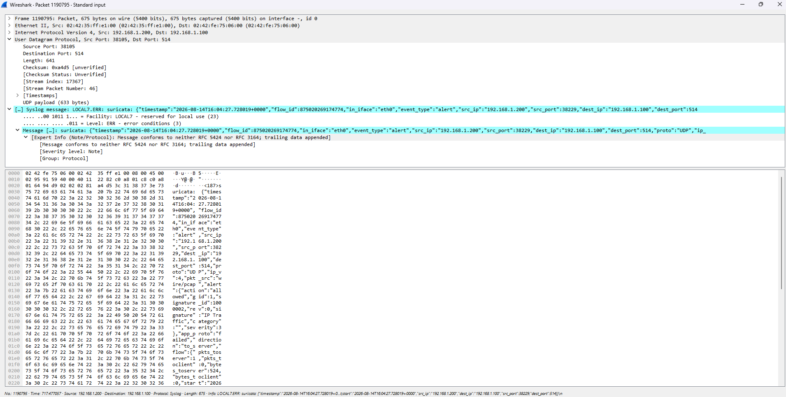

# DEMO: SURICATA IDS ALERT GENERATION AND CENTRALIZED COLLECTION

## Overview

This demonstration implements complete SIEM security alert collection using:
 
- **GNS3 Network Emulation**: Virtual network topology
- **Central-Server (Toolbox Appliance)**: rsyslog server (alert aggregation point)
- **Suricata IDS (Docker Container as appliance)**: IDS/IPS engine generating security alerts
- **VPCS (Virtual PC Simulator)**: Attack traffic generator
- **Ethernet Switch**: Network connectivity layer

---
 
## Architecture
 
```
┌──────────────────────────────────────────────────────────────────────┐
│                  COMPLETE SIEM ALERT COLLECTION LAB                  │
├──────────────────────────────────────────────────────────────────────┤
│                                                                      │
│  ATTACK GENERATION          IDS MONITORING           LOG AGGREGATION │
│  ┌──────────────┐          ┌──────────────┐          ┌─────────────┐ │
│  │   VPCS       │          │  Suricata    │          │   Central   │ │
│  │   (Attacker) │          │  (Docker)    │          │   Server    │ │
│  │192.168.1.10  │──ping───→│192.168.1.200 │─syslog──→│192.168.1.100│ │
│  │              │          │              │          │             │ │
│  │ Generates    │          │ Monitors eth0│          │ rsyslog :514│ │
│  │ traffic to   │          │              │          │             │ │
│  │ trigger      │          │ Matches rules│          │ IDS rules   │ │ 
│  │              │          │ Eve.json     │          │ Stores in   │ │
│  │ ICMP packets │          │ alerts       │          │ /var/log/   │ │
│  │ TCP attempts │          │              │          │ suricata/   │ │
│  │              │          │ Syslog fwd   │          │ alerts.log  │ │
│  └──────────────┘          └──────────────┘          └─────────────┘ │
│         └──────────────────────────┼────────────────────────┘        │
│                                    │                                 │
│                       Connected via Ethernet Switch                  │
│                                                                      │
└──────────────────────────────────────────────────────────────────────┘
```

---

## Prerequisites

### GNS3 Setup

1. GNS3 installed and running

2. Toolbox appliance (GNS3 default)

    - Download appliance from https://gns3.com/marketplace/appliances/networkers-toolkit

    - Select appliance:

        

    - Import appliance:

        

    - Drag device:

        

3. Suricata IDS (Docker Container as appliance)

    - Download appliance from this repo: [suricata.gns3a](./suricata.gns3a)

    - Select appliance:

        

    - Import appliance:

        

    - Install suricata:

        

    - Drag suricata appliance and pulling image:

        

    - Suricata docker image pulling can be reflected:

        

4. Deploy VPCS as attack generator:

    - Drag VPCS appliance:

        

5. Deploy Switch to interconnect devices:

    - Drag Switch appliance:

        

## INTERCONNECT AND RUN INFRASTRUCTURE

1. Interconnect devices and run the project:

    

## CONFIGURE INFRASTRUCTURE

### STEP 1: CONFIGURE CENTRAL-SERVER INTERFACE

Assign IPv4 address to Central-Server's eth0 interface so it can receive syslog messages from R1.

- Access R1 Console: In GNS3, right-click R1 → Console → Connect or use telnet from a Linux VM, e.g.:
 
 ```bash
 test@test:~$ telnet 192.168.98.130 5004
 ```

- Configure IP address in the Server eth0 interface:

 ```bash
 root@Central-Server:~# ip link set eth0 up
 root@Central-Server:~# ip addr add 192.168.1.100/24 dev eth0
 root@Central-Server:~# ip a show eth0
 ```

-  Create Alert Directory
 
 ```bash
 root@Central-Server:~# mkdir -p /var/log/suricata
 root@Central-Server:~# chown syslog:adm /var/log/suricata
 root@Central-Server:~# chmod 755 /var/log/suricata
 ```

- Add Log Routing Rules by editing `/etc/rsyslog.conf`:
 
 ```bash
 root@Central-Server:~# nano /etc/rsyslog.conf
 ```

- Add at the end of the file (before any `$IncludeConfig` directives):
 
 ```bash
 # Route Suricata alerts to separate file
 :fromhost-ip, isequal, "192.168.1.200" /var/log/suricata/alerts.log
 :fromhost-ip, isequal, "192.168.1.200" stop
 
 # Catch-all for other remote logs
 *.* /var/log/remote-hosts.log
 ```

- Restart Rsyslog
 
 ```bash
 root@Central-Server:~# service rsyslog restart
  * Stopping enhanced syslogd rsyslogd                    [ OK ]
  * Starting enhanced syslogd rsyslogd                    [ OK ]
 ```

- Verify Rsyslog Listening
 
 ```bash
 root@Central-Server:~# ss -tulpn | grep 514
 udp     UNCONN   0        0                0.0.0.0:514            0.0.0.0:*   users:(("rsyslogd",pid=123,fd=6))
 tcp     LISTEN   0        25               0.0.0.0:514            0.0.0.0:*   users:(("rsyslogd",pid=123,fd=8))
 ```

### STEP 2: CONFIGURE ATTACKER

Assign IPv4 address to VPCS's eth0 interface so it can receive syslog messages from R1.

- Access VPCS Console
 
 ```bash
 test@test:~$ telnet 192.168.98.130 5002
 ```
 
- Configure Network
 
 ```bash
 VPCS> set pcname attacker
 VPCS> ip 192.168.1.10 255.255.255.0 192.168.1.1
 VPCS> show ip
 ```

 **Expected Output:**

 ```log
 Attacker> show ip

 NAME        : Attacker[1]
 IP/MASK     : 192.168.1.10/24
 GATEWAY     : 192.168.1.1
 DNS         : 
 MAC         : 00:50:79:66:68:00
 LPORT       : 20006
 RHOST:PORT  : 127.0.0.1:20007
 MTU         : 1500
 ```

- Test Connectivity
 
 ```bash
 VPCS> ping 192.168.1.100
 # Should get replies from Central-Server
 
 VPCS> ping 192.168.1.200
 # Should get replies from Suricata
 ```

### STEP 3: CONFIGURE SURICATA CONTAINER (IDS ENGINE)

- Access Suricata Container, from Linux GNS3 server:
 
 ```bash
 ssh gns3@192.168.98.130
 ```
 ```bash
 gns3@gns3vm:~$ docker ps | grep suricata
 # Copy full CONTAINER ID
 ```
 ```bash 
 docker exec -it GNS3.SuricataIDSDocker.e1181ec3-a17a-4190-907b-ef9f624eb3b0 bash
 [root@SuricataIDSDocker /]# 
 ```
 
- Inside container:
 
 ```bash
 [root@SuricataIDSDocker-1 /]# ip addr add 192.168.1.200/24 dev eth0
 [root@SuricataIDSDocker-1 /]# ip route add default via 192.168.1.1
 ```

- Verify Network
 
 ```bash
 [root@SuricataIDSDocker-1 /]# ip a
 # Should show: inet 192.168.1.200/24 on eth0
 
 [root@SuricataIDSDocker-1 /]# ping 192.168.1.100
 # Should get replies
 ```

- Create Suricata Detection Rules.
 
 ```bash
 [root@SuricataIDSDocker-1 /]# mkdir -p /var/lib/suricata/rules/
 [root@SuricataIDSDocker-1 /]# cat > /var/lib/suricata/rules/test.rules << 'EOF'
 alert icmp any any -> any any (msg:"ICMP Detected"; content:"|08|"; dsize:<65535; sid:1000001; rev:1;)
 alert tcp any any -> any 22 (msg:"SSH Connection"; flags:S; sid:1000002; rev:1;)
 alert tcp any any -> any any (msg:"TCP Traffic"; flow:to_server,established; sid:1000003; rev:1;)
 EOF
 ```

- Update Suricata Configuration by editing `/etc/suricata/suricata.yaml`:
 
 ```bash
 [root@SuricataIDSDocker-1 /]# vi /etc/suricata/suricata.yaml
 ```

 **Find `rule-files:`**
 
 ```yaml
 rule-files:
   - test.rules
 ```

- Restart Suricata Engine
 
 ```bash
 # Kill running Suricata
 [root@SuricataIDSDocker-1 /]# pkill -9 suricata
 [root@SuricataIDSDocker-1 /]# sleep 2
 
 # Start fresh
 [root@SuricataIDSDocker-1 /]# suricata -i eth0 -c /etc/suricata/suricata.yaml &
 [1] 1234
 [root@SuricataIDSDocker-1 /]# sleep 5

- Verify Rules Loaded
 
 ```bash
 [root@SuricataIDSDocker-1 /]# tail -10 /var/log/suricata/suricata.log | grep -i "rule"
 [1234 - Suricata-Main] 2026-08-14 12:18:42 Info: detect: 1 rule files processed. 3 rules successfully loaded, 0 rules failed, 0 rules skipped
 [1234 - Suricata-Main] 2026-08-14 12:18:42 Info: detect: 3 signatures processed. 0 are IP-only rules, 3 are inspecting packet payload, 0 inspect application layer, 0 are decoder event only
 ```

- Install Syslog forwader

 Suricata generates alerts in eve.json format. We need to forward them to Central-Server via syslog.

- Create Forwarding Script

 ```bash
 [root@SuricataIDSDocker-1 /]# cat > /usr/local/bin/syslog-forward.sh << 'EOF'
 #!/bin/bash
 # Forward Suricata eve.json alerts to Central-Server syslog
 tail -f /var/log/suricata/eve.json 2>/dev/null | while read line; do
   echo "<187>suricata: $line" > /dev/udp/192.168.1.100/514
 done
 EOF
  
 chmod +x /usr/local/bin/syslog-forward.sh
 ```

- Start Forwarder
 
 ```bash
 [root@SuricataIDSDocker-1 /]# /usr/local/bin/syslog-forward.sh &
 [2] 5678
 
 [root@SuricataIDSDocker-1 /]# jobs
 [1]   Running suricata -i eth0 -c /etc/suricata/suricata.yaml &
 [2]-  Running /usr/local/bin/syslog-forward.sh &
 ```
 
- Verify Connectivity
 
 ```bash
 [root@SuricataIDSDocker-1 /]# echo "test" > /dev/udp/192.168.1.100/514
 # No error output = success (UDP is connectionless)
 ```

### STEP : MONITOR ALERTS ON CENTRAL-SERVER

- Open Alert Monitoring Terminal
 
 ```bash
 root@Central-Server:~# tail -f /var/log/suricata/alerts.log
 ```

- Generate Attack Traffic From VPCS. From VPCS console:
 
 ```bash
 attacker> ping 192.168.1.200 -c 10
 84 bytes from 192.168.1.200 icmp_seq=1 ttl=64 time=0.691 ms
 84 bytes from 192.168.1.200 icmp_seq=2 ttl=64 time=0.620 ms
 84 bytes from 192.168.1.200 icmp_seq=3 ttl=64 time=0.402 ms
 ...
 ```

- Review Syslog:

 ```bash
 grep "ICMP Detected" /var/log/suricata/alerts.log
 ```
 
 **Expected output**

 ```log
 Aug 14 15:41:28 192.168.1.200 suricata: {"timestamp":"2026-08-14T15:41:28.323123+0000","flow_id":925058262631623,"in_iface":"eth0","event_type":"alert","src_ip":"192.168.1.200","dest_ip":"192.168.1.10","proto":"ICMP","ip_v":4,"icmp_type":0,"icmp_code":0,"pkt_src":"wire/pcap","alert":{"action":"allowed","gid":1,"signature_id":1000001,"rev":1,"signature":"ICMP Detected","category":"","severity":3},"direction":"to_client","flow":{"pkts_toserver":13,"pkts_toclient":13,"bytes_toserver":1274,"bytes_toclient":1274,"start":"2026-08-14T15:38:59.936277+0000","src_ip":"192.168.1.10","dest_ip":"192.168.1.200"}}
 ```
 
- Alert Statistics
 
 ```bash
 root@Central-Server:~# wc -l /var/log/suricata/alerts.log
 10 /var/log/suricata/alerts.log
 # 10 ICMP alerts received
 ```

- Syslog transmission in action is captured using Wireshark

    