# DEMO 3: LOG NORMALIZATION WITH GRAYLOG

## Overview
 
This demonstration implements **log normalization and structured data extraction** using:
 
- **GNS3 Network Emulation**: Virtual network topology (from Demo 1)
- **R1 (Cisco C7200 Router)**: Syslog source (operational logs)
- **MongoDB (GNS3 Docker Appliance)**: Graylog configuration backend
- **Elasticsearch (GNS3 Docker Appliance)**: Structured log storage and indexing
- **Graylog (GNS3 Docker Appliance)**: Log aggregation, processing, and normalization engine

### Three Normalization Steps

*Step 1: Define Log Message Format*

 ```
 Raw Cisco Syslog:
 Aug 11 16:25:57 192.168.1.50 24: *Aug 11 16:20:45.871: %SYS-5-CONFIG_I: Configured from console by console
     
     ├─ Timestamp: Aug 11 16:20:45.871
     ├─ Severity: 5 (Notice)
     ├─ Message Code: CONFIG_I
     ├─ Details: "Configured from console by console"
     └─ Source IP: 192.168.1.50
 ```
 
*Step 2: Create Grok Pattern*

 ```
 Grok pattern extracts fields:
  
 %{CISCO_SYSLOG_PATTERN}
  
 Extracts:
   - timestamp
   - device_ip
   - severity_code
   - message_code
   - message_text
   - event_type (normalized)
 ```
 
*Step 3: Create Message Processing Pipeline*

 ```
 Graylog Pipeline Processing:
  
 1. Parse with Grok pattern
 2. Extract and enrich fields
 3. Normalize severity levels
 4. Classify event type
 5. Index structured data in Elasticsearch
 
         ↓
  
 Result: Normalized, Searchable, Visualizable Logs
 ```
 
---
 
## Architecture
 
```
┌──────────────────────────────────────────────────────────────────┐
│       GRAYLOG LOG NORMALIZATION STACK (GNS3 APPLIANCES)          │
├──────────────────────────────────────────────────────────────────┤
│                                                                  │
│  LOG SOURCE          GNS3 APPLIANCES        STORAGE              │
│  ┌─────────┐        ┌──────────────────┐  ┌──────────────┐       │
│  │ R1      │        │   MongoDB        │  │              │       │
│  │Router   │        │   (Port 27017)   │  │ Elasticsearch│       │
│  │192.1.50 │────┐   └──────────────────┘  │  (Port 9200) │       │
│  │         │    │                         │              │       │
│  │ Syslog  │    ├──→ ┌──────────────────┐ ├──────────────┤       │
│  │ Events  │    │    │     Graylog      │ │ Normalized   │       │
│  └─────────┘    │    │   (Port 1514)    │ │ Indexed Data │       │
│                 │    │                  │ │              │       │
│                 │    │ Processing:      │→├──────────────┤       │
│                 │    │ ├─ Grok Pattern  │ │              │       │
│                 │    │ ├─ Extract       │ │ Searchable   │       │
│                 │    │ ├─ Normalize     │ │ Fields:      │       │
│                 │    │ └─ Enrich        │ │ -src_ip      │       │
│                 │    │                  │ │ -sev_level   │       │
│                 │    └──────────────────┘ │ -event_type  │       │
│                 │                         │ -msg_text    │       │
│                 └────────────────────────→└──────────────┘       │
│                  UDP:1514                                        │
│                                                                  │
│  Unstructured Cisco Syslog ──→ Normalized JSON in Elasticsearch  │
│                                                                  │
└──────────────────────────────────────────────────────────────────┘
```
 
---

## Prerequisites

### GNS3 Setup

1. GNS3 installed and running

2. Drag Virtual Switch to canvas:

    - Drag Switch appliance:

        

3. Drag Cisco C7200 (R1) to canvas:

    - Download dynamips from https://drive.google.com/file/d/1cQ3y24eMJ3SjwLWeAu_hxIsO51Y0CRHX/view?usp=sharing

    - Select preferences:

        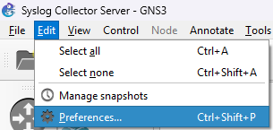

    - Import dynamips:

        

    - Drag device:

        

4. Drag MongoDB appliance to canvas:

    - Download appliance from this repo: [mongodb-appliance.gns3a](./mongodb-appliance.gns3a)

    - Select MongoDB appliance:

        

    - Open MogoDB Graylog appliance:

        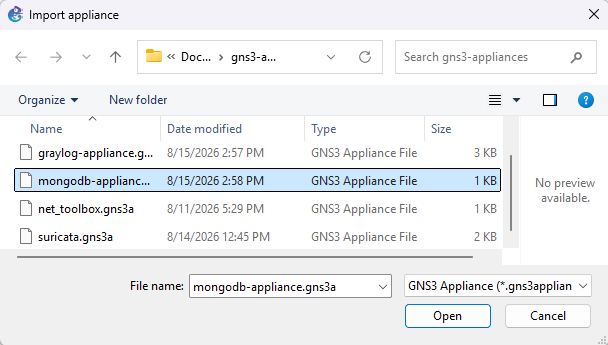

    - Install MogoDB Graylog appliance:

        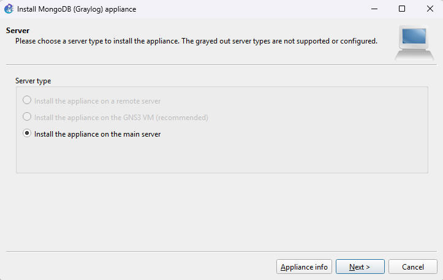

    - Installed MogoDB Graylog appliance:

        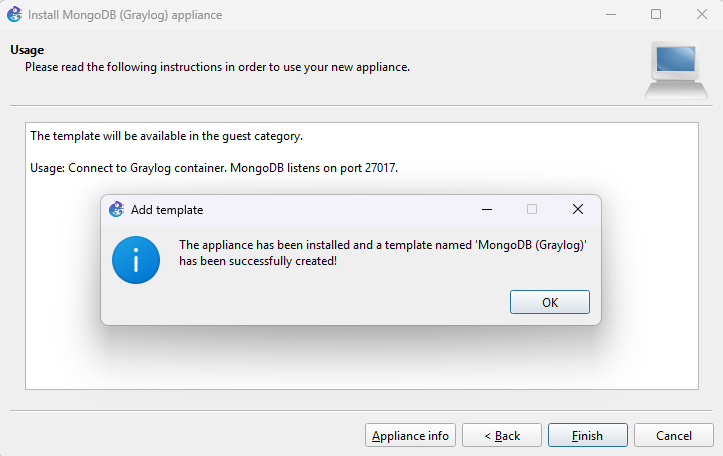

    - Drag MogoDB Graylog appliance and pulling image:

        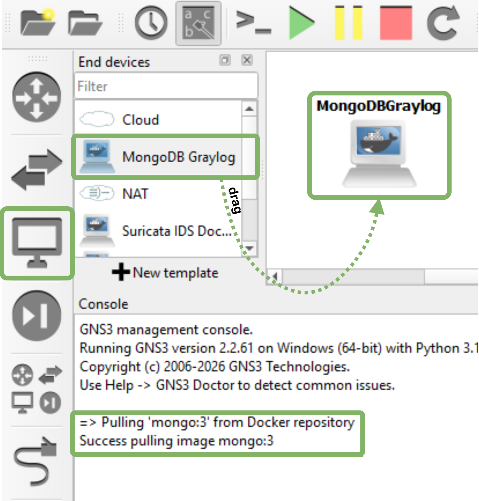

    - MogoDB Graylog docker image pulling can be reflected:

        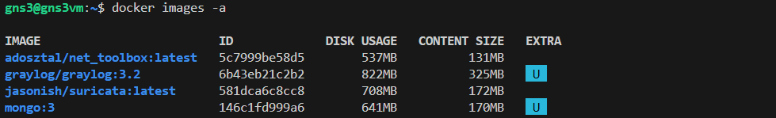

5. Drag Elasticsearch appliance to canvas:

    - Download appliance from this repo: [elasticsearch-appliance.gns3a](./elasticsearch-appliance.gns3a)

    - Select Elasticsearch appliance:

        

    - Elasticsearch appliance:

        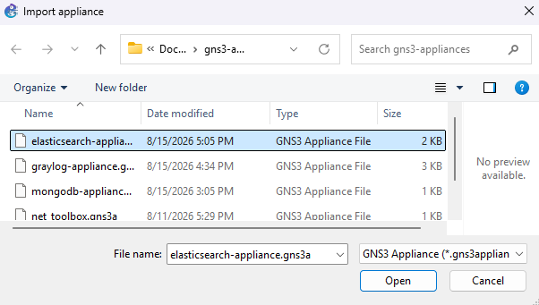

    - Install Graylog appliance:

        

    - Installed Graylog appliance:

        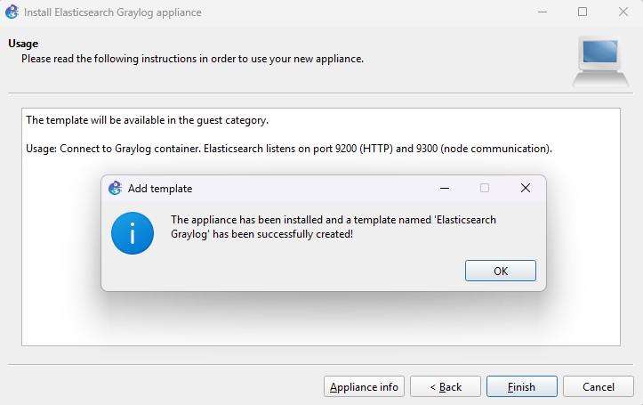

    - Drag Elasticsearch appliance and pulling image:

        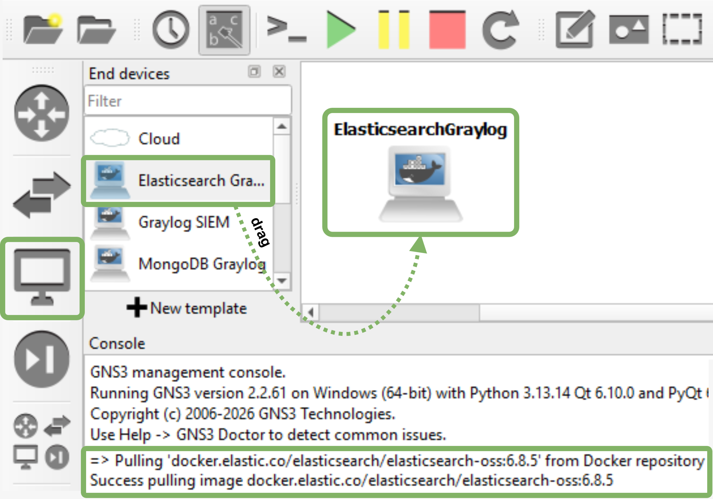

    - Elasticsearch docker image pulling can be reflected:

        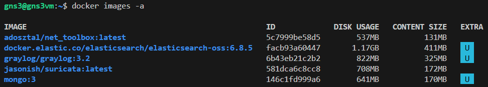

6. Drag Graylog appliance to canvas:

    - Download appliance from this repo: [graylog-appliance.gns3a](./graylog-appliance.gns3a)

    - Select Graylog appliance:

        

    - Open Graylog appliance:

        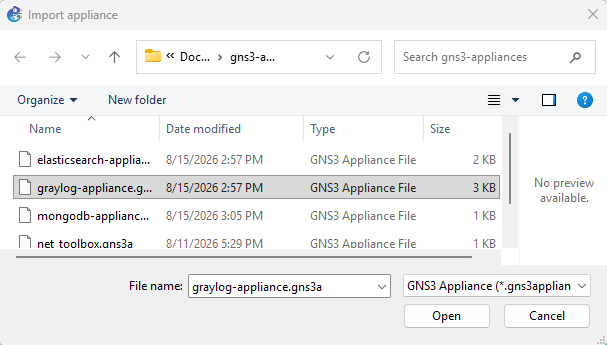

    - Install Graylog appliance:

        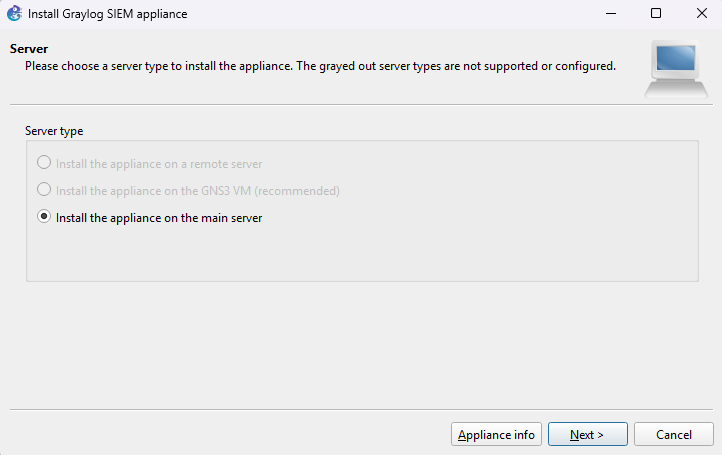

    - Installed Graylog appliance:

        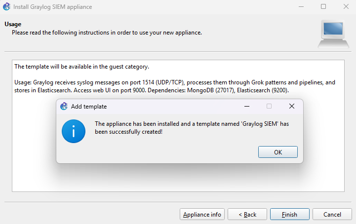

    - Drag Graylog appliance and pulling image:

        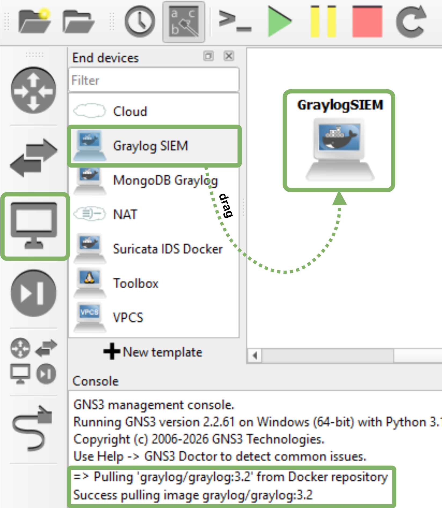

    - Graylog docker image pulling can be reflected:

        

## INTERCONNECT AND RUN INFRASTRUCTURE

1. Interconnect devices and run the project:

    - Connect R1 interface f0/0 → Switch
    - Connect GraylogSIEM eth0 → Switch
    - Connect ElasticsearchGraylog eth0 → Switch
    - Connect MongoDBGraylog eth0 → Switch

    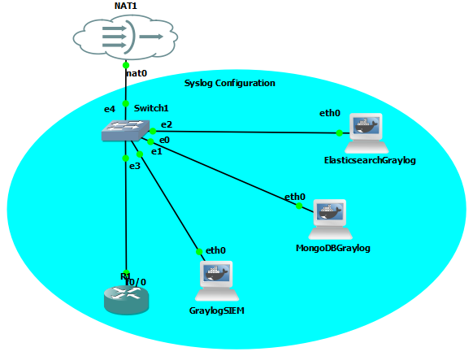

2. Start Infrastructure
 
 - Right-click project → Start all nodes
 - Wait 2-3 minutes for containers to initialize
 - Verify Docker containers running:
   
 ```bash
 docker ps
 # Should show: graylog, elasticsearch-oss, mongo
 ```

## CONFIGURATION STEPS

1. Configure R1

 ```bash
 R1# configure terminal
 R1(config)# interface FastEthernet0/0
 R1(config-if)# ip address 192.168.42.50 255.255.255.0
 R1(config-if)# no shutdown
 R1(config-if)# end

 R1(config)# ip route 0.0.0.0 0.0.0.0 192.168.42.1
 R1(config)# end

 R1# ping 192.168.42.1
 ```

2. Configure R1 Syslog

 ```bash
 R1# configure terminal
 R1(config)# logging 192.168.42.11
 R1(config)# logging trap informational
 R1(config)# end

 R1# show logging
 # Output should show:
 # Trap logging: level informational, 45 message lines logged
 #     Logging to 192.168.42.11 (udp port 514)
 ```

3. Configure MONGODB Container

 ```bash
 docker exec -it GNS3.MongoDBGraylog.* bash

 root@MongoDBGraylog:/# cat > /etc/network/interfaces << 'EOF'
 auto eth0
 iface eth0 inet static
     address 192.168.42.10
     netmask 255.255.255.0
     gateway 192.168.42.1
     up echo nameserver 192.168.42.1 > /etc/resolv.conf
 EOF

 root@MongoDBGraylog:/# cat > /etc/hosts << 'EOF'
 127.0.0.1       localhost
 192.168.42.10   mongo
 192.168.42.11   graylog
 192.168.42.12   elasticsearch
 EOF
 
 root@MongoDBGraylog:/# exit

 # Restart to apply network changes
 docker restart GNS3.MongoDBGraylog.*
 ```

4. Create User in GRAYLOG DATABASE

 ```bash
 docker exec -it GNS3.MongoDBGraylog.* bash

 root@MongoDBGraylog:/# mongo -u admin -p admin --authenticationDatabase admin

 > use graylog
 switched to db graylog

 > db.createUser({
   user: "admin",
   pwd: "admin",
   roles: [{role: "readWrite", db: "graylog"}]
 })

 # Returns: Successfully added user

 > exit

 root@MongoDBGraylog:/# exit
 ```

5. Configure ELASTICSEARCH Container

 ```bash
 docker exec -it GNS3.ElasticsearchGraylog.* bash

 root@ElasticsearchGraylog:/# cat > /etc/network/interfaces << 'EOF'
 auto eth0
 iface eth0 inet static
     address 192.168.42.12
     netmask 255.255.255.0
     gateway 192.168.42.1
     up echo nameserver 192.168.42.1 > /etc/resolv.conf
 EOF
 
 root@ElasticsearchGraylog:/# cat > /etc/hosts << 'EOF'
 127.0.0.1       localhost
 192.168.42.10   mongo
 192.168.42.11   graylog
 192.168.42.12   elasticsearch
 EOF
 
 root@ElasticsearchGraylog:/# exit

 # Restart to apply network changes
 docker restart GNS3.ElasticsearchGraylog.*
 ```

6. Configure Graylog Container

 ```bash
 docker exec -it GNS3.GraylogSIEM.* bash

 root@GraylogSIEM:/# cat > /etc/network/interfaces << 'EOF'
 auto eth0
 iface eth0 inet static
     address 192.168.42.11
     netmask 255.255.255.0
     gateway 192.168.42.1
     up echo nameserver 192.168.42.1 > /etc/resolv.conf
 EOF
 
 root@GraylogSIEM:/# cat > /etc/hosts << 'EOF'
 127.0.0.1       localhost
 192.168.42.10   mongo
 192.168.42.11   graylog
 192.168.42.12   elasticsearch
 EOF
 
 root@GraylogSIEM:/# exit

 # Restart to apply network changes
 docker restart GNS3.GraylogSIEM.* 
 ```

---

## LOG COLLECTION

1. Create a UDP syslog input on Graylog to receive messages from R1:

 ```bash
 curl -X POST http://192.168.42.11:9000/api/system/inputs \
  -u admin:admin \
  -H "Content-Type: application/json" \
  -H "X-Requested-By: cli" \
  -d '{
    "title": "Router Syslog",
    "type": "org.graylog2.inputs.syslog.udp.SyslogUDPInput",
    "global": true,
    "configuration": {
      "bind_address": "0.0.0.0",
      "port": 514
    }
  }'
 ```

 **Response:**

 ```json
 {
   "id": "6a881b9f61f3b7006584019c"}
 ```

2. Generate test Messages

 ```bash
 # Generate test event on R1
 R1# configure terminal
 R1(config)# interface FastEthernet0/0
 R1(config-if)# shutdown
 R1(config-if)# no shutdown
 R1(config-if)# end
 ```

3. Message monitored by Wireshark:

 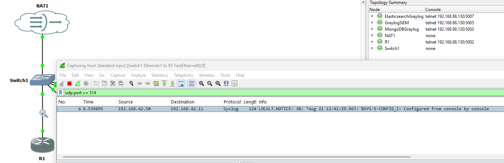

4. Verify Messages in Elasticsearch
 
 ```bash
 gns3@gns3vm:~$ curl -s "http://192.168.42.12:9200/graylog_0/_count" | jq '.count'
 2
  
 gns3@gns3vm:~$ curl -s "http://192.168.42.12:9200/graylog_0/_search?size=10" | \
   jq '.hits.hits[] | {message: ._source.message, timestamp: ._source.timestamp}'
  
 [
   {
     "message": "%LINK-3-UPDOWN: Interface FastEthernet0/0, changed state to up",
     "timestamp": "2026-08-21 12:54:52.651"
   },
   {
     "message": "%SYS-5-CONFIG_I: Configured from console by console",
     "timestamp": "2026-08-21 12:41:29.967"
   }
 ]
 ```

---
 
## LOG NORMALIZATION

> Normalization is converting **unstructured syslog text** into **structured, searchable fields**.

1. Real Message Example
 
 **Actual message from R1:**
 ```
 Raw: "%SYS-5-CONFIG_I: Configured from console by console"
  
 Components:
 ├─ Facility: SYS (System)
 ├─ Severity: 5 (Notice)
 ├─ Code: CONFIG_I (Configuration event)
 └─ Text: "Configured from console by console"
 ```

2. Add Normalization Static Fields
 
 ```bash
 # Get your syslog input ID
 INPUT_ID="6a884674eadb5a0065e66a6b"
  
 # Add normalized fields
 curl -X POST http://192.168.42.11:9000/api/system/inputs/$INPUT_ID/staticfields \
   -u admin:admin \
   -H "Content-Type: application/json" \
   -H "X-Requested-By: cli" \
   -d '{"key":"message_code","value":"SYS-5-CONFIG_I"}'
  
 curl -X POST http://192.168.42.11:9000/api/system/inputs/$INPUT_ID/staticfields \
   -u admin:admin \
   -H "Content-Type: application/json" \
   -H "X-Requested-By: cli" \
   -d '{"key":"event_type","value":"Configuration Change"}'
  
 curl -X POST http://192.168.42.11:9000/api/system/inputs/$INPUT_ID/staticfields \
   -u admin:admin \
   -H "Content-Type: application/json" \
   -H "X-Requested-By: cli" \
   -d '{"key":"event_severity","value":"Notice"}'
  
 curl -X POST http://192.168.42.11:9000/api/system/inputs/$INPUT_ID/staticfields \
   -u admin:admin \
   -H "Content-Type: application/json" \
   -H "X-Requested-By: cli" \
   -d '{"key":"event_component","value":"System"}'
  
 curl -X POST http://192.168.42.11:9000/api/system/inputs/$INPUT_ID/staticfields \
   -u admin:admin \
   -H "Content-Type: application/json" \
   -H "X-Requested-By: cli" \
   -d '{"key":"is_security_relevant","value":"true"}'
 ```

3. Verify Normalized Message
 
 ```bash
 # Generate new message on R1
 R1# configure terminal
 R1(config)# interface FastEthernet0/0
 R1(config-if)# shutdown
 R1(config-if)# no shutdown
 R1(config-if)# end
  
 # Wait 5 seconds, then check
 curl -s "http://192.168.42.12:9200/graylog_0/_search?size=1&sort=timestamp:desc" | \
   jq '.hits.hits[0]._source | {message, message_code, event_type, event_severity, event_component, is_security_relevant, source, timestamp}'
 ```
  
 **Result (NORMALIZED MESSAGE):**
 ```json
 {
   "message": "%LINK-3-UPDOWN: Interface FastEthernet0/0, changed state to up",
   "message_code": "SYS-5-CONFIG_I",
   "event_type": "Configuration Change",
   "event_severity": "Notice",
   "event_component": "System",
   "is_security_relevant": "true",
   "source": "192.168.42.50",
   "timestamp": "2026-08-21 12:54:52.651"
 }
 ```

---
 
## STREAM-BASED CLASSIFICATION
 
> Create Classification Streams
 
1. Link State Changes
 
 ```bash
 # Create stream
 curl -X POST http://192.168.42.11:9000/api/streams \
   -u admin:admin \
   -H "Content-Type: application/json" \
   -H "X-Requested-By: cli" \
   -d '{
     "title": "Link State Changes",
     "description": "LINK-3-UPDOWN interface events",
     "index_set_id": "6a88255461f3b7006eee6806"
   }'
  
 # Save returned stream ID: 6a882eef61f3b700718db04c
  
 # Add rule
 curl -X POST http://192.168.42.11:9000/api/streams/6a882eef61f3b700718db04c/rules \
   -u admin:admin \
   -H "Content-Type: application/json" \
   -H "X-Requested-By: cli" \
   -d '{
     "type": 6,
     "field": "message",
     "value": "LINK",
     "inverted": false
   }'
 ```
  
2. Configuration Changes
  
 ```bash
 curl -X POST http://192.168.42.11:9000/api/streams \
   -u admin:admin \
   -H "Content-Type: application/json" \
   -H "X-Requested-By: cli" \
   -d '{
     "title": "Configuration Changes",
     "description": "CONFIG_I events",
     "index_set_id": "6a88255461f3b7006eee6806"
   }'
  
 # Save ID: 6a882bd161f3b7006eee6fdf
  
 curl -X POST http://192.168.42.11:9000/api/streams/6a882bd161f3b7006eee6fdf/rules \
   -u admin:admin \
   -H "Content-Type: application/json" \
   -H "X-Requested-By: cli" \
   -d '{
     "type": 6,
     "field": "message",
     "value": "CONFIG",
     "inverted": false
   }'
 ```
  
3. Protocol State Changes
  
 ```bash
 curl -X POST http://192.168.42.11:9000/api/streams \
   -u admin:admin \
   -H "Content-Type: application/json" \
   -H "X-Requested-By: cli" \
   -d '{
     "title": "Protocol State Changes",
     "description": "LINEPROTO-5-UPDOWN events",
     "index_set_id": "6a88255461f3b7006eee6806"
   }'
  
 # Save ID: 6a882f0061f3b700718db061
  
 curl -X POST http://192.168.42.11:9000/api/streams/6a882f0061f3b700718db061/rules \
   -u admin:admin \
   -H "Content-Type: application/json" \
   -H "X-Requested-By: cli" \
   -d '{
     "type": 6,
     "field": "message",
     "value": "LINEPROTO",
     "inverted": false
   }'
 ```
 
4. Verify All Streams
 
 ```bash
 curl -s http://192.168.42.11:9000/api/streams -u admin:admin | \
   jq '.streams[] | select(.disabled==true) | {title, rule_value: .rules[0].value}'
  
 # Output:
 # {
 #   "title": "Link State Changes",
 #   "rule_value": "LINK"
 # }
 # {
 #   "title": "Configuration Changes",
 #   "rule_value": "CONFIG"
 # }
 # {
 #   "title": "Protocol State Changes",
 #   "rule_value": "LINEPROTO"
 # }
 ```

## OPERATIONAL VERIFICATION
 
1. System Health Checks
 
 ```bash
 # 1. Graylog health
 curl -s http://192.168.42.11:9000/api/system/overview -u admin:admin | \
   jq '.lifecycle'
 # Should return: "RUNNING"
  
 # 2. Elasticsearch cluster
 curl -s http://192.168.42.12:9200/_cluster/health | \
   jq '{status, active_shards}'
 # {
 #   "status": "green",
 #   "active_shards": 12
 # }
  
 # 3. Syslog input
 curl -s http://192.168.42.11:9000/api/system/inputs -u admin:admin | \
   jq '.inputs[] | {title, type, state}'
 # {
 #   "title": "Router Syslog",
 #   "type": "SyslogUDPInput",
 #   "state": "RUNNING"
 # }
  
 # 4. Message count
 curl -s "http://192.168.42.12:9200/graylog_0/_count" | jq '.count'
 # 2+
 ```