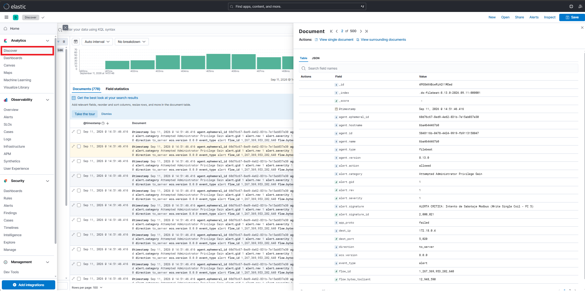

# Honeypot-SIEM integration

Este demostración despliega un entorno industrial que incluye la herramienta de ataque ModTester, el honeypot ICS Conpot, el IDS Suricata, la infraestructura ELK.

## 1. Despliegue de la Infraestructura

Para iniciar todo el ecosistema de servicios (Honeypot, IDS, SIEM), navega a la carpeta de infraestructura y ejecuta:

```bash
cd Demo8
docker-compose up -d
```

Verifique que todos los contenedores están en ejecución con: 
```bash
docker ps
```

## 2. Guía de Uso
Para realizar una validación completa, siga estos pasos en terminales independientes:

### A. Lanzar ataques desde ModTester
Abra una segunda terminal para inyectar tráfico malicioso y generar evidencias:

```bash
docker exec -it tfm_modtester bash
python modTester.py
```
Una vez dentro del prompt del ModTester, elija el vector de ataque deseado:

### Escaneo de registros:

```
use modbus/scanner/holdingRegisterDiscover
set RHOSTS 172.18.0.6 (o la ip que tenga asignada conpot)
set RPORT 5020
set UID 1
exploit
```

```
use modbus/dos/writeSingleRegister
set RHOSTS 172.18.0.6 (o la ip que tenga asignada conpot)
set RPORT 5020
set UID 4
exploit
```

### 3. Visualización de Resultados

- Configurar Kibana dashboard: `python3 setup/setup_kibana.py`
- Monitorización: Puede acceder a Kibana para ver la traza del ataque en tiempo real en http://localhost:5601.
- Clic en Analytics/Discover



### 4. Solución de problemas

Asegúrese de que el sensor "lapa" esté activo:
````bash
 docker exec -it tfm_suricata ip addr (debe tener la misma IP que el honeypot).
````

Verifique los logs del contenedor de Suricata si el tráfico no está siendo capturado.